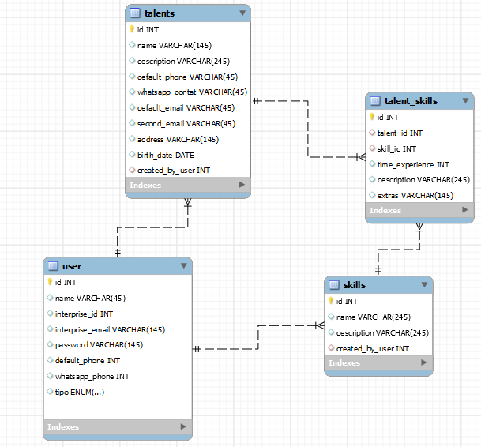

# PROJETO BANCO DE TALENTOS

projeto possibilita você ter uma banco de dados completo com pessoas que são candidato e tem talento para um certo cargo na empresa.

o sistema faz com o usuário possa fazer um CRUD completo dos seus dados dos candidatos com os dados:

além desses dados do candidato temos outros que o usuário pode inserir como os dados de habilidades, cidades, estados, área de atuação.

OBJETIVO PRINCIPAL:

- ter um ambiente em que o recrutador posso ter de uma forma simples uma quantidade de talentos e posso adquirir eficiência em seu trabalho fazendo com que tanto seja mais simples para o talento/candidato se candidatar e apresentar seus talentos quanto para o recrutador de talento.

OBJETIVO SECUNDÁRIO:

- Pesquisar em forma de filtro os talentos/candidatos
- candidato pode criar seu perfil
- recrutador pode avaliar perfil de candidato

modelo entidade relacionamento:

## tecnologias usadas:

**BANCO DE DADOS**: MYSQL

**BACKEND**: Node(Nestjs)

**FRONTEND**: Reactjs

**EXTRA**: Typescript